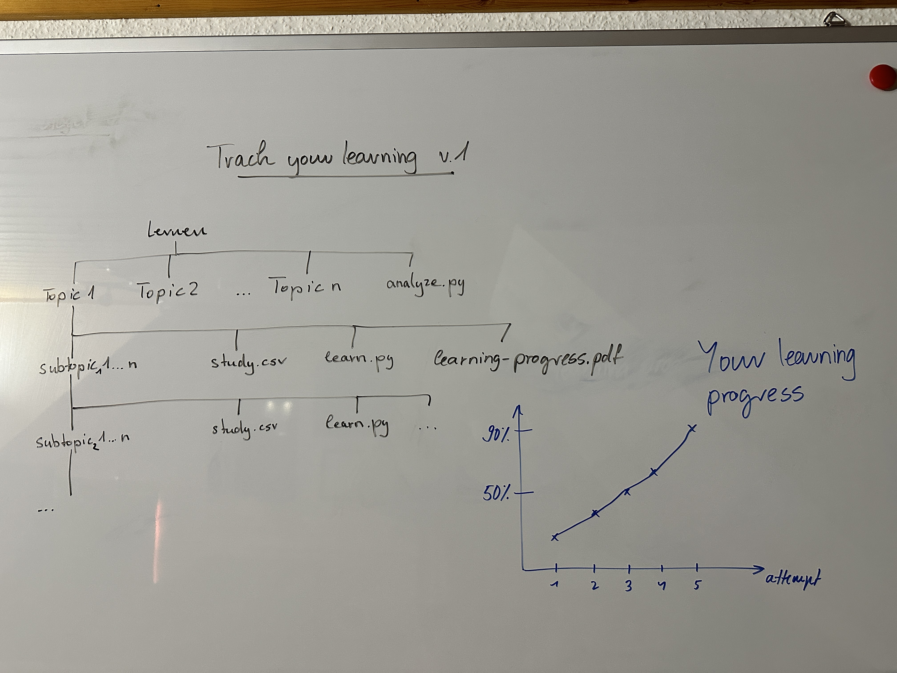

# Track your learning

**Idea : Do you remember those people in high school, who spend ages preparing for an exam but still performed poorly?** Well, I do ... One thing that I noticed about them is that they were always super concerned about having high quality notes. Preparing for an exam often meant for them writing extensive summaries.  

I also sometimes find myself spending more time preparing the information that I'm going to learn, then actively learning and repeating the content. Hoping that somehow, the information that I'm working with will stick. This might work for small topics or topics that are not overly complex, however when you are dealing with extensive information that you want to learn in great detail (and you also face time constraints), then a better approach would be to take the information as it is (not spending ages preparing summaries) and focus on learning / repeating / making sure that you are familiar with the content.

**This repository encourages you to just do that.** The idea is that you go through the (lets say) lecture slides and for each slide you ask yourself: "after learning this slide, what would I be able to answer". So you formulate a question and write it into the **study.csv**. You also enter, where you would find the answer to that question (example: slide 36). You can break your topic down into subtopics (just like in the data folder). After creating your study.csv(s). You can run the **learn.py** which will print you the question you formulated. See if you can answer the question and if you're satisfied with your answer, enter a "t" (True) for answering the question correctly (f for not answering it correctly). After you finished answering all the questions, learn.py will write the results into the study.csv . 

Type in the console : `python learn.py True` (True for shuffeling the questions, default is False)

**Run the analyze.py in the main directory** and it will go through all the subdirectories, process the study.csv and plot it. You will find the corresponding learning_progress.pdf in the same directory as the study.csv . Viewing your Learning Graph can help you to gain a better understanding of your learning progress. 

Note : This is a super simplistic implementation (which only took me about 3-4 hours). If you are looking for a great learning app / assistant then you would be well advised to search on the major app stores. For me, none of the learning apps provided what I was looking for (also I'm a little cheap, i didn't want to pay anyone anything), so I came up with my own solution that I will continue to develop / improve. On the other side, the simplicity of this implementation allows you to just grab it and adjust it to **YOUR** needs and add data that **YOU** are interested in. 